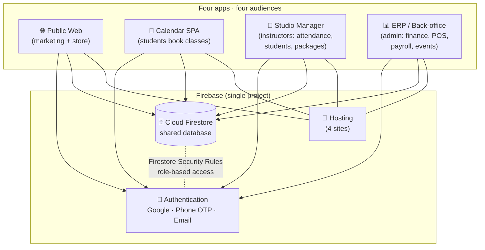

# 🌿 Bhumi Yoga — Studio Operating System (Public Demo)

> A four-app ecosystem that runs a real boutique yoga studio on a single
> shared Firestore database: bookings, attendance, packages, point-of-sale,
> accounting, instructor payroll and a public marketing site — with **zero
> double data entry** across the whole business.

**🔗 Live demo:** [bhumi-yoga-demo.web.app](https://bhumi-yoga-demo.web.app) — the public marketing site, deployed to an isolated demo Firebase project.

<p>
  
  
  
  
  
  
</p>

---

## ℹ️ About this repository

This is a **sanitized public showcase** of a system currently running in
production for a real yoga studio in Armenia, Colombia. It mirrors the
architecture and source of the private repository, but **all real credentials,
backend config, personal data and contact details have been replaced with
fictional demo values**. It exists so the work can be shared on a résumé,
in technical communities and in AI challenges without exposing the live
business or its customers.

- 🔒 No real API keys, project IDs or analytics IDs — they come from `.env`
- 🧑‍🤝‍🧑 No real staff or customer PII — instructors, emails and phones are fictional
- 🏗️ The architecture, data model and application logic are faithful to production

---

## 🎯 The problem

A yoga studio typically runs on notebooks, WhatsApp chats and scattered
spreadsheets. The same booking gets written down three times, there is no
reliable cash balance, and nobody can tell which student's package is about to
expire. The business runs on memory and good faith.

**Bhumi Yoga is one ecosystem with one source of truth.** A class booking
becomes attendance, then accounting income, then instructor payroll — without
anyone retyping a thing.

---

## 🏛️ Architecture



The key design decision: **all four apps read and write the same Firestore
collections.** A reservation created in the Calendar is the same record the
Studio Manager marks as attended and the ERP counts as revenue and turns into
instructor payroll. Access is enforced entirely through Firestore Security
Rules keyed on the authenticated user's email/role.

---

## 📦 The four apps

| App | Folder | Audience | Stack | Does |
|---|---|---|---|---|
| **Studio Manager** | [`apps/studio-manager`](apps/studio-manager) | Instructors | React + TS + Vite + Tailwind (PWA) | Attendance, student CRUD, packages, renewals, reports, scheduling |
| **ERP / Back-office** | [`apps/erp`](apps/erp) | Admin | React + TS + Vite + Tailwind | Accounting with periods & transfers, POS/store, instructor payroll, events, dashboards |
| **Calendar** | [`apps/calendar`](apps/calendar) | Students | Vanilla JS + Tailwind (no build) | Self-service class booking with client-side atomic capacity control |
| **Public Web** | [`apps/web`](apps/web) | Public | Static HTML + Tailwind | Marketing site, pricing/plans, store → WhatsApp checkout, legal pages |

---

## 🗄️ Data model (Firestore)

| Collection | Owner | Purpose |
|---|---|---|
| `students` | Studio Manager | Student records, packages & attendance (`fechas[]`) — read by all apps |
| `agendamientos` | Calendar | Class bookings created/cancelled by students |
| `slots` | Calendar | Atomic counters enforcing class capacity |
| `userProfiles` | Calendar | Student profiles & roles |
| `transactions` | ERP | Accounting entries (income/expense, transfers, opening balances) |
| `inventory` / `storeSales` | ERP | Store catalog and point-of-sale |
| `events` | ERP | Special events & workshops |
| `cashReconciliations` | ERP | Cash drawer reconciliation |

Admin role = a studio email domain, enforced in [`firestore.rules`](firestore.rules).

---

## ✨ Highlighted engineering

- **One database, four clients, zero double entry** — bookings flow into
  attendance, revenue and payroll automatically.
- **Atomic capacity control** in vanilla JS using Firestore transactions on
  `slots` counters, so a class can't be overbooked under concurrency.
- **Role-based security** fully in Firestore Rules (no trusted backend) —
  students touch only their own data, admins get the back office.
- **Package lifecycle**: numeric package tiers, auto 30-day validity,
  attendance archiving on renewal, and an audit log of renewals.
- **Finance with real accounting**: period filters, account transfers,
  opening-balance journal entries and KPIs that exclude transfers/adjustments.
- **Multi-site deploy** from one Firebase project (4 Hosting targets).

---

## 🚀 Run it locally

The two React apps (`studio-manager`, `erp`) build with Vite:

```bash
cd apps/studio-manager      # or apps/erp
cp .env.example .env        # fill with your own demo Firebase project values
npm install
npm run dev
```

The Calendar and Public Web are static — open the HTML directly or serve the
folder with any static server. To connect them to a backend, drop your demo
Firebase config into the inline `firebaseConfig` block.

> See [`docs/architecture.md`](docs/architecture.md) for a deeper write-up.

---

## 🧑‍💻 My role

I designed and built this ecosystem end to end: the data model and Firestore
security rules, the four front-ends, the authentication flows (Google / phone
OTP), the accounting and payroll logic, and the multi-site Firebase deployment
and release workflow.

---

## 📄 License

[MIT](LICENSE) — the code is shared for learning and portfolio purposes. The
"Bhumi Yoga" name and branding belong to the studio.
